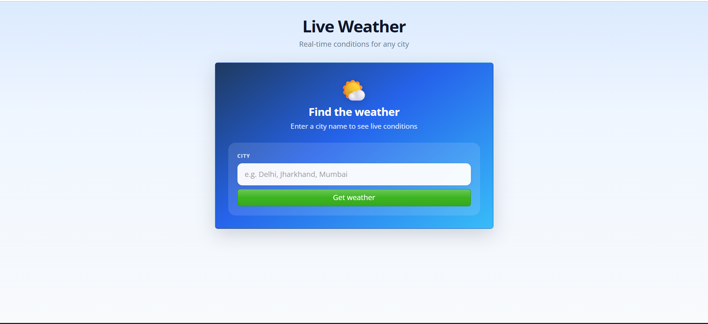
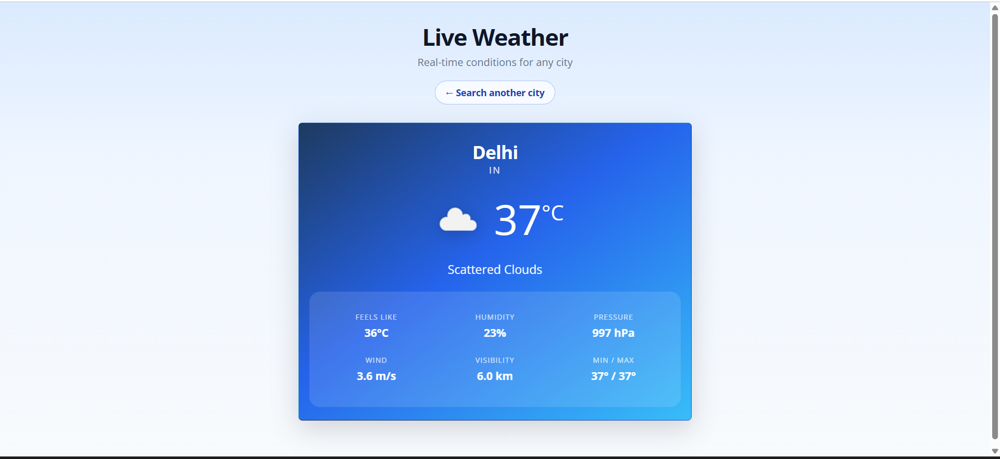

# Live Weather App

A modern React single-page application that fetches and displays **real-time weather** for any city using the [OpenWeatherMap API](https://openweathermap.org/api).

## Project achievements

- Built a **React 19** SPA with a modular component structure (`App`, `Home`, `ShowWeather`)
- Integrated the **OpenWeatherMap API** with **Axios** for live weather data
- Managed application state with **React Hooks** (`useState`) and conditional rendering
- Added **error handling** with `try/catch` and user-friendly feedback via a **Bootstrap Modal**
- Secured the API key using **environment variables** (`.env`)
- Designed a **responsive, mobile-friendly UI** with **React Bootstrap** and custom CSS
- Implemented a full **search → results** flow with a **search again** option
- Displayed detailed weather metrics: temperature, feels-like, humidity, pressure, wind, visibility, and min/max

## Features

- Search any city by name and view current conditions
- Weather results card with icon, description, and key stats
- Polished gradient UI with frosted-glass panels
- Error modal for invalid city names (auto-closes after 3 seconds)
- Navigate back to search another city anytime

## Tech stack

| Category   | Tools                        |
| ---------- | ---------------------------- |
| Frontend   | React 19, React DOM          |
| HTTP       | Axios                        |
| UI         | Bootstrap 5, React Bootstrap |
| API        | OpenWeatherMap               |
| Tooling    | Create React App             |

## Project structure

```
src/
├── App.js                 # App shell, API fetch, error modal, view switching
├── App.css                # Global app layout and header styles
├── components/
│   ├── Home.jsx           # City search form
│   ├── Home.css
│   ├── ShowWeather.jsx    # Weather results display
│   └── ShowWeather.css
├── index.js
└── bootstrap.min.css
```

## Getting started

### Prerequisites

- [Node.js](https://nodejs.org/) (v14 or later)
- An [OpenWeatherMap](https://openweathermap.org/api) API key

### Installation

1. Clone the repository:

   ```bash
   git clone <your-repo-url>
   cd live-weater-app
   ```

2. Install dependencies:

   ```bash
   npm install
   ```

3. Create a `.env` file in the project root:

   ```env
   REACT_APP_API_KEY=your_openweathermap_api_key
   ```

   > **Note:** `.env` is listed in `.gitignore` — never commit your API key.

4. Start the development server:

   ```bash
   npm start
   ```

5. Open [http://localhost:3000](http://localhost:3000) in your browser.

## Available scripts

| Command         | Description                     |
| --------------- | ------------------------------- |
| `npm start`     | Run the app in development mode |
| `npm run build` | Build for production            |
| `npm test`      | Run the test runner             |

## How it works

1. Enter a city name on the home screen and submit the form.
2. The app requests data from the OpenWeatherMap API using Axios.
3. On success, the weather card shows temperature (°C), conditions, and additional metrics.
4. On failure (e.g. invalid city), an error modal appears and closes automatically after 3 seconds.
5. Use **Search another city** to return to the search form and look up a new location.

## Environment variables

| Variable            | Description                    |
| ------------------- | ------------------------------ |
| `REACT_APP_API_KEY` | Your OpenWeatherMap API key    |

## Project Demo

### Home — search for a city



### Weather results



## License

This project is open source and available for learning and portfolio use.
